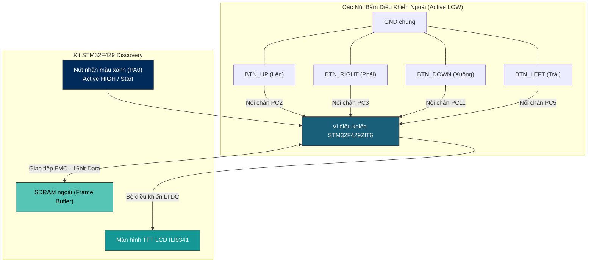
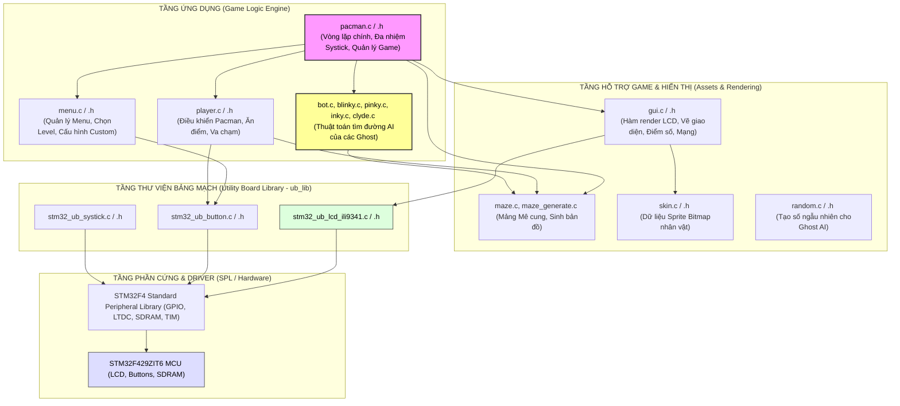

# BÁO CÁO ĐỒ ÁN MÔN HỌC: THIẾT KẾ HỆ THỐNG NHÚNG
## ĐỀ TÀI: GAME PACMAN TRÊN KIT STM32F429 DISCOVERY

---

# Giới thiệu

## Tổng quan trò chơi

Dự án này thực hiện thiết kế và lập trình trò chơi cổ điển **Pacman** trên kit phát triển nhúng **STM32F429 Discovery**. Trò chơi không chỉ tái hiện đầy đủ các yếu tố cơ bản của tựa game Pacman truyền thống (di chuyển trong mê cung, ăn chấm điểm, tránh né quái vật) mà còn tích hợp các thuật toán trí tuệ nhân tạo (AI Pathfinding) phức tạp cho các Ghost (bóng ma) và thiết lập chế độ chơi đa dạng để tăng tính hấp dẫn.

### Mô tả kịch bản game và các chức năng chính:

1. **Luật chơi cốt lõi (Core Gameplay):**
   - Người chơi điều khiển nhân vật **Pacman** di chuyển qua các lối đi trong mê cung để ăn toàn bộ các chấm điểm nhỏ (Dots).
   - Trên bản đồ có các chấm sức mạnh lớn (Energizers). Khi Pacman ăn được chấm to này, các Ghost sẽ bị chuyển sang trạng thái **Hoảng sợ (Frightened)** trong một khoảng thời gian ngắn (đổi sang màu xanh lam và di chuyển chậm lại). Lúc này Pacman có thể quay lại đuổi bắt và ăn các Ghost để nhận lượng điểm thưởng lớn.
   - Ghost bị ăn sẽ bị tiêu diệt và chỉ còn lại đôi mắt di chuyển nhanh quay trở về chuồng Ghost (Ghost House) để hồi sinh (Dead State).
   - Nếu Pacman va chạm với Ghost ở trạng thái bình thường, Pacman sẽ bị mất 1 mạng (Lives) và trò chơi hồi sinh lại vị trí xuất phát. Người chơi có tổng cộng 3 mạng. Trò chơi kết thúc khi người chơi ăn hết tất cả các chấm điểm (Chiến thắng - Victory) hoặc bị hết mạng (Thua cuộc - Game Over).

2. **Chế độ chơi (Game Modes):**
   - **Chế độ Chiến dịch (Campaign Mode):** Người chơi sẽ vượt qua lần lượt **10 cấp độ khó tăng tiến**. Mỗi cấp độ khó sẽ nâng cấp cả tốc độ di chuyển của Pacman/Ghost lẫn số lượng và chiến thuật AI của các Ghost (từ mức rất dễ - 1 Ghost di chuyển ngẫu nhiên, cho đến mức ác mộng - 4 Ghost AI di chuyển cực nhanh với tốc độ 24ms, đòi hỏi người chơi phải phản xạ và cua góc thật chuẩn).
   - **Chế độ Tùy chỉnh (Custom Mode):** Cho phép người chơi tự thiết lập các thông số trước khi chơi bao gồm: lựa chọn Bản đồ (Map), Số lượng người chơi (1 người chơi hoặc 2 người chơi Co-op phối hợp/2P đối kháng Ghost), Số lượng Ghost (1 đến 4), Tốc độ của Ghost (Chậm/Bình thường/Nhanh) và lựa chọn cụ thể chiến thuật AI cho từng Ghost.

3. **Giao diện Menu Điều khiển:**
   - Hệ thống cung cấp một Menu điều khiển trực quan trước khi vào game để người chơi thiết lập thông số (như mức độ khó và chế độ chơi Campaign/Custom).

4. **Kịch bản di chuyển của 6 loại Ghost (AI Pathfinding):**
   Mỗi Ghost trong game sở hữu một tính cách (Personality) và chiến thuật di chuyển riêng biệt để vây bắt người chơi, bao gồm:
   - **Blinky — Chiến thuật "Chase" (Đuổi theo trực tiếp):**
     * *Hành vi:* Đuổi theo Pacman một cách liên tục và quyết liệt nhất.
     * *Cách xác định mục tiêu:* Lấy tọa độ mục tiêu trực tiếp là vị trí hiện tại của Pacman: $T_{x} = P_{xp}, T_{y} = P_{yp}$.
   - **Pinky — Chiến thuật "Ambush" (Phục kích đón đầu):**
     * *Hành vi:* Di chuyển đón đầu trước mặt hướng đi của Pacman để chặn các lối ngách.
     * *Cách xác định mục tiêu:* Lấy tọa độ mục tiêu là ô thứ 4 phía trước mặt Pacman theo hướng di chuyển hiện tại:
       - Nếu Pacman đi lên: $T_{x} = P_{xp}, T_{y} = P_{yp} - 4$.
       - Nếu Pacman đi xuống: $T_{x} = P_{xp}, T_{y} = P_{yp} + 4$.
       - Nếu Pacman đi sang phải: $T_{x} = P_{xp} + 4, T_{y} = P_{yp}$.
       - Nếu Pacman đi sang trái: $T_{x} = P_{xp} - 4, T_{y} = P_{yp}$.
   - **Inky — Chiến thuật "Tricky" (Vây ráp phối hợp):**
     * *Hành vi:* Phối hợp cùng Blinky để tạo thế bao vây gọng kìm ép Pacman vào giữa.
     * *Cách xác định mục tiêu:* Lấy điểm tựa $P_{temp}$ cách trước mặt Pacman 2 ô. Vẽ một vector từ vị trí hiện tại của Blinky ($B$) tới điểm tựa $P_{temp}$, sau đó nhân đôi vector này để xác định vị trí mục tiêu cuối cùng của Inky:
       $$T_{target} = B + 2 \times (P_{temp} - B)$$
   - **Clyde — Chiến thuật "Shy" (Nhút nhát):**
     * *Hành vi:* Đuổi theo khi ở xa Pacman, nhưng sẽ hoảng sợ bỏ chạy về góc trú ẩn riêng khi đến quá gần Pacman.
     * *Cách xác định mục tiêu:* Tính toán khoảng cách Euclid bình phương giữa Clyde và Pacman ($d_{clyde}^2$).
       - Nếu khoảng cách lớn hơn 8 ô ($d_{clyde}^2 > 64$): Đuổi trực tiếp giống Blinky (mục tiêu là vị trí Pacman).
       - Nếu khoảng cách nhỏ hơn hoặc bằng 8 ô ($d_{clyde}^2 \le 64$): Đổi mục tiêu về góc trú ẩn dưới bên trái bản đồ (Scatter Point) để lánh nạn.
   - **Ghost Drunk — Chiến thuật "Drunk" (Say rượu / Đi ngẫu nhiên):**
     * *Hành vi:* Lang thang vô định trên bản đồ, hoàn toàn vô hại và không bám đuổi người chơi.
     * *Cách xác định mục tiêu:* Tại mỗi ngã rẽ, Ghost sử dụng hàm tạo số ngẫu nhiên `rand() % 4` để chọn ngẫu nhiên một trong các hướng đi hợp lệ (hướng đi thông thoáng và không quay đầu giật lùi).
   - **Ghost Lazy — Chiến thuật "Lazy" (Lười biếng / Rình rập):**
     * *Hành vi:* Đi ngẫu nhiên khi người chơi ở xa và chỉ bắt đầu bám đuổi quyết liệt khi người chơi đi vào phạm vi rình rập của nó.
     * *Cách xác định mục tiêu:* Tính khoảng cách Euclid bình phương giữa Ghost và Pacman ($d^2$).
       - Nếu Pacman ở ngoài phạm vi bán kính 6 ô ($d^2 > 36$): Chạy chiến thuật **Drunk** (đi ngẫu nhiên hoàn toàn).
       - Nếu Pacman đi vào trong phạm vi bán kính 6 ô ($d^2 \le 36$): Chuyển sang chiến thuật **Blinky** (đuổi theo trực tiếp Pacman).

---

## Phân công công việc

Dưới đây là bảng gợi ý phân công công việc dành cho nhóm thực hiện dự án (bạn có thể tự thay đổi tên thành viên phù hợp):

| STT | Thành viên | Nhiệm vụ chi tiết | Trạng thái |
|:---:|---|---|:---:|
| 1 | **Thành viên A** (Trưởng nhóm) | - Thiết kế kiến trúc tổng thể phần mềm. - Lập trình cấu hình phần cứng (Clock, GPIO, LCD LTDC, SDRAM). - Triển khai thuật toán AI di chuyển cho các Ghost (Blinky, Pinky, Inky, Clyde). | Hoàn thành |
| 2 | **Thành viên B** | - Xây dựng và quản lý cấu trúc bản đồ mê cung (`maze.c`, `maze_generate.c`). - Thiết kế, chuyển đổi và tích hợp tài nguyên đồ họa (Sprites, Bitmaps của nhân vật, tường, chấm điểm). - Lập trình logic điều khiển Pacman và kiểm tra va chạm (`player.c`). | Hoàn thành |
| 3 | **Thành viên C** | - Thiết kế và lập trình giao diện Menu điều khiển, quản lý trạng thái chuyển tiếp game (`menu.c`). - Đấu nối mạch phần cứng nút bấm vật lý, viết driver chống rung phím sử dụng Timer ngắt. - Soạn thảo báo cáo và làm slide thuyết trình. | Hoàn thành |

---

# Hệ thống phần cứng

## Giới thiệu các phần cứng được sử dụng

Dự án tận dụng các tài nguyên phần cứng mạnh mẽ có sẵn trên kit phát triển kết hợp với các nút bấm cơ học bên ngoài:

1. **Kit STM32F429 Discovery (MCU STM32F429ZIT6):**
   - *Tác dụng:* Là bộ xử lý trung tâm (CPU) điều khiển toàn bộ hệ thống nhúng. Chip sở hữu lõi ARM Cortex-M4 hoạt động ở tần số lên đến 180 MHz, tích hợp bộ tăng tốc đồ họa LTDC và FMC điều khiển SDRAM giúp xử lý thuật toán AI và render đồ họa thời gian thực cực kỳ mượt mà.
2. **Màn hình TFT LCD QVGA (ILI9341 - 2.4 inch, độ phân giải 240x320 pixels):**
   - *Tác dụng:* Thiết bị hiển thị giao diện đồ họa chính của trò chơi (Mê cung, các nhân vật, Menu cấu hình, Bảng điểm số Score, số mạng Lives và các thông báo Win/Lose).
3. **Màn hình cảm ứng (Touchscreen Controller STMPE811) - Không sử dụng:**
   - *Tác dụng:* Trong phiên bản hiện tại, để tối ưu hóa hiệu năng và giải phóng tài nguyên hệ thống, màn hình cảm ứng không còn được sử dụng trong dự án này. Mọi thao tác tương tác menu và điều khiển nhân vật đều được thực hiện thông qua nút nhấn vật lý hoặc Joystick.
4. **Bộ nhớ ngoài SDRAM (64 Mbits):**
   - *Tác dụng:* Được sử dụng làm bộ đệm khung hình hiển thị (Frame Buffer) cho bộ điều khiển đồ họa LTDC. Do RAM nội bộ của chip không đủ chứa các lớp hình ảnh hiển thị độ phân giải QVGA 16-bit màu, SDRAM bên ngoài đóng vai trò quyết định giúp đồ họa hiển thị không bị giật hay xé hình.
5. **Nút bấm vật lý ngoài (4 nút bấm điều hướng rời):**
   - *Tác dụng:* Giúp người chơi điều khiển Pacman di chuyển (Lên, Xuống, Trái, Phải). Các nút bấm được kết nối trực tiếp với các chân GPIO của STM32 (`PC2`, `PC3`, `PC5` hoặc `PC11`) hoạt động ở mức logic tích cực thấp (Active LOW) nhờ điện trở kéo lên nội bộ (Internal Pull-Up).
6. **Nút nhấn User Button mặc định trên kit (PA0):**
   - *Tác dụng:* Hoạt động ở mức tích cực cao (Active HIGH), dùng làm nút Xác nhận (Start/Center/Select) để bắt đầu game từ Menu.

---

## Mô tả sơ đồ mạch hệ thống

Dưới đây là sơ đồ kết nối các nút bấm vật lý ngoài và cấu trúc giao tiếp giữa vi điều khiển STM32F429 với màn hình TFT LCD:

### Chi tiết bảng đấu nối dây nút bấm rời:

| Nút bấm chức năng | Chân GPIO | Cách kết nối vật lý | Mức logic tích cực | Trạng thái phần mềm |
| :--- | :--- | :--- | :--- | :--- |
| **`BTN_UP` (Lên)** | **`PC2`** | Một đầu nối `PC2`, đầu kia nối **`GND`** | Active LOW (Mặc định `1`, nhấn nút = `0`) | Kéo lên nội bộ (Internal Pull-Up) |
| **`BTN_RIGHT` (Phải)** | **`PC3`** | Một đầu nối `PC3`, đầu kia nối **`GND`** | Active LOW (Mặc định `1`, nhấn nút = `0`) | Kéo lên nội bộ (Internal Pull-Up) |
| **`BTN_DOWN` (Xuống)** | **`PC11`** | Một đầu nối `PC11`, đầu kia nối **`GND`** | Active LOW (Mặc định `1`, nhấn nút = `0`) | Kéo lên nội bộ (Internal Pull-Up) |
| **`BTN_LEFT` (Trái)** | **`PC5`** | Một đầu nối `PC5`, đầu kia nối **`GND`** | Active LOW (Mặc định `1`, nhấn nút = `0`) | Kéo lên nội bộ (Internal Pull-Up) |
| **`BTN_CENTER` (Start)** | **`PA0`**| Sử dụng nút User màu xanh trên Kit | Active HIGH (Mặc định `0`, nhấn nút = `1`)| Kéo xuống nội bộ (No Pull-up/down) |

---

# Hệ thống phần mềm

## Kiến trúc tổng thể phần mềm

Hệ thống phần mềm được xây dựng theo kiến trúc phân tầng để tách biệt rõ ràng giữa quản lý phần cứng, giao diện hiển thị và logic xử lý trò chơi:

### Giải thích vai trò của các Module chính:

1. **Module Điều phối Trò chơi (`main.c` & `pacman.c`/`.h`):**
   - `main.c` là điểm khởi đầu, thực hiện cấu hình thạch anh hệ thống (`SystemInit()`) và khởi động game thông qua hàm `pacman_start()`.
   - `pacman.c` quản lý toàn bộ luồng đời của game. Nó chứa hàm vòng lặp game chính `pacman_play()`. Module này chịu trách nhiệm quản lý điểm số (`Score`), số mạng (`Lives`), mức độ khó hiện tại (`Level`), trạng thái hoảng sợ của quái vật (`Frightened`), và chuyển đổi giữa các trạng thái Scatter (Ghost tản ra góc) / Chase (Ghost bám đuổi) của trò chơi.

2. **Module Điều khiển Người chơi (`player.c`/`.h`):**
   - Xử lý tọa độ, hướng di chuyển hiện tại và hướng đi dự kiến tiếp theo của Pacman.
   - Nhận tín hiệu điều khiển từ nút bấm vật lý (thông qua hàm quét phím) để thay đổi hướng đi.
   - Kiểm tra va chạm với tường mê cung (ngăn cản Pacman đi xuyên tường) và xử lý sự kiện ăn các chấm điểm nhỏ (cộng điểm), ăn chấm to (kích hoạt chế độ Frightened của các Ghost).
   - Xử lý hoạt ảnh xoay miệng của Pacman theo hướng di chuyển.

3. **Module Quản lý Mê cung (`maze.c`/`.h` & `maze_generate.c`/`.h`):**
   - Định nghĩa mảng hai chiều biểu diễn lưới bản đồ mê cung (định nghĩa ô nào là tường, ô nào là đường đi, ô nào chứa chấm thức ăn, ô nào là chuồng Ghost).
   - `maze_generate.c` cung cấp các thuật toán sinh/kiểm tra mê cung tự động để đảm bảo bản đồ hợp lệ (không bị kẹt, các đường đi thông suốt).

4. **Module Giao diện Đồ họa (`gui.c`/`.h` & `skin.c`/`.h`):**
   - `skin.c` lưu trữ các sprite đồ họa dưới dạng mảng byte bitmap (được chuyển đổi sẵn từ hình ảnh Pacman và Ghost gốc).
   - `gui.c` chịu trách nhiệm render hình ảnh lên màn hình LCD TFT qua bộ đệm khung (Frame Buffer) SDRAM. Module này vẽ bản đồ mê cung, điểm số, mạng chơi, màn hình chào mừng, menu cấu hình, màn hình thắng (Victory Screen) hoặc thua (Game Over Screen) một cách trực quan, sinh động.

5. **Module Quản lý Ghost và AI Tìm đường (`bot.c`, `blinky.c`, `pinky.c`, `inky.c`, `clyde.c`):**
   - `bot.c` quản lý cấu trúc dữ liệu chung của cả 4 Ghost (vị trí, trạng thái Alive/Frightened/Dead, tốc độ).
   - Từng Ghost sở hữu một thuật toán AI tìm đường riêng biệt được triển khai trong các file tương ứng, kế thừa cơ chế tìm đường bằng toán học.

### Cơ chế hoạt động và Logic phần mềm của Game:

1. **Đa nhiệm Độc lập nhờ Timer ngắt (Cooperative Multitasking):**
   - Game không sử dụng hệ điều hành nhúng (RTOS) để tiết kiệm tài nguyên. Thay vào đó, tốc độ di chuyển độc lập giữa Pacman và các Ghost được điều khiển thông qua các biến đếm Systick (ví dụ: `Player_Systick_Timer_ms`, `Blinky_Systic_Timer_ms`, v.v.). Các biến này được giảm dần trong hàm ngắt Systick của hệ thống (mỗi 1ms).
   - Trong vòng lặp chính `pacman_play()`, phần mềm liên tục kiểm tra nếu bộ đếm của nhân vật nào về 0 thì mới cập nhật di chuyển cho nhân vật đó và nạp lại giá trị tốc độ tương ứng (ví dụ: Pacman di chuyển mỗi 30ms, Blinky di chuyển mỗi 40ms ở Level 1). Điều này giúp các nhân vật di chuyển mượt mà với các tốc độ độc lập khác nhau.

2. **Thuật toán tìm đường AI của các Ghost:**
   - Tại mỗi ngã rẽ trong mê cung, Ghost sẽ tính toán hướng đi tiếp theo. Thuật toán hoạt động như sau:
     - Xác định tọa độ mục tiêu $T_{target}(x, y)$ dựa trên thuật toán tính cách riêng của Ghost (như đã mô tả ở phần Giới thiệu).
     - Duyệt qua tối đa 4 hướng đi có thể rẽ (Lên, Xuống, Trái, Phải). Hướng đối lập với hướng đang đi sẽ bị loại bỏ để tránh Ghost quay đầu đột ngột (trừ khi chuyển sang chế độ Frightened).
     - Với mỗi hướng hợp lệ, tính toán khoảng cách Euclid bình phương từ ô tiếp theo đó tới tọa độ mục tiêu:
       $$d^2 = (x_{next} - x_{target})^2 + (y_{next} - y_{target})^2$$
     - Ghost sẽ lựa chọn hướng đi có khoảng cách $d^2$ ngắn nhất để di chuyển tiếp.

3. **Cơ chế phát hiện va chạm (Collision Detection):**
   - Sau mỗi bước di chuyển, hàm `player_check_collisions()` được gọi để kiểm tra xem tọa độ của Pacman có trùng khớp với bất kỳ Ghost nào đang hoạt động hay không.
   - Nếu xảy ra va chạm:
     - Nếu Ghost đang ở trạng thái **Alive** (bình thường): Pacman bị tiêu diệt, trừ mạng chơi, phát hoạt ảnh chết và reset lại màn chơi.
     - Nếu Ghost đang ở trạng thái **Frightened** (hoảng sợ do Pacman ăn chấm to): Ghost bị Pacman ăn, đổi trạng thái sang **Dead** (chỉ còn đôi mắt chạy về chuồng hồi sinh), đồng thời cộng điểm thưởng lớn cho Pacman.

---

# Kết quả đạt được

*(Phần này bạn hãy chụp ảnh thực tế màn hình Kit chạy game Pacman và chèn vào báo cáo theo hướng dẫn dưới đây)*

Dự án đã triển khai thành công trò chơi Pacman hoàn chỉnh trên kit STM32F429 Discovery với đầy đủ các tính năng đề ra. Dưới đây là mô tả luồng vận hành của game kèm theo các hình ảnh kết quả thực tế:

### 1. Giao diện Menu chính khi khởi động hệ thống
- **Hình ảnh minh họa:** *(Bạn chụp ảnh màn hình Menu lựa chọn Chế độ chơi và độ khó)*
- **Giải thích:** Khi khởi động hệ thống, màn hình TFT LCD hiển thị Menu chính cho phép lựa chọn chế độ chơi (Campaign / Custom) và cài đặt mức độ khó xuất phát (Start Level từ 1 đến 10). Người dùng sử dụng các nút bấm vật lý điều hướng Lên/Xuống/Trái/Phải để di chuyển vệt sáng và thay đổi giá trị, sau đó nhấn nút xanh User Button (chân PA0) để xác nhận khởi động game.

### 2. Màn hình chuẩn bị bắt đầu màn chơi (Get Ready)
- **Hình ảnh minh họa:** *(Bạn chụp ảnh màn hình lúc đếm ngược 1, 2, 3, GO)*
- **Giải thích:** Sau khi nhấn Start, bản đồ mê cung được vẽ ra rõ nét, các nhân vật (Pacman và các Ghost) được xếp vào các vị trí xuất phát mặc định. Hệ thống thực hiện đếm ngược từ 3 về 1 và hiện chữ "GO" kèm theo độ trễ hệ thống để người chơi chuẩn bị trước khi các nhân vật bắt đầu di chuyển.

### 3. Quá trình vận hành game thực tế (Gameplay)
- **Hình ảnh minh họa:** *(Bạn chụp ảnh Pacman đang di chuyển ăn chấm điểm và các Ghost đang đuổi theo)*
- **Giải thích:** Người chơi bấm các nút điều hướng ngoài để điều khiển hướng đi của Pacman. Màn hình cập nhật tọa độ liên tục mà không xảy ra hiện tượng giật lag nhờ cơ chế Double Buffer (sử dụng SDRAM làm bộ đệm khung). Các Ghost bám đuổi quyết liệt theo đúng chiến thuật AI lập trình sẵn. Điểm số (Score) ở góc dưới màn hình liên tục tăng khi Pacman ăn chấm điểm.

### 4. Trạng thái các Ghost hoảng sợ khi Pacman ăn chấm to (Frightened Mode)
- **Hình ảnh minh họa:** *(Bạn chụp ảnh khi ăn chấm to, các Ghost đổi sang màu xanh lam)*
- **Giải thích:** Ngay khi Pacman ăn chấm to (Energizer), các Ghost lập tức đổi màu sang xanh lam, di chuyển chậm lại và di chuyển hỗn loạn trốn chạy Pacman. Nếu Pacman va chạm với Ghost lúc này, Ghost sẽ bị tiêu diệt (biến thành đôi mắt chạy về chuồng) và người chơi được cộng điểm thưởng.

### 5. Kết quả thắng/thua (Victory & Game Over)
- **Hình ảnh minh họa:** *(Bạn chụp ảnh màn hình Victory Screen hoặc Game Over Screen)*
- **Giải thích:** 
  - Nếu Pacman ăn hết toàn bộ chấm thức ăn trong mê cung, màn hình sẽ hiển thị thông báo **VICTORY** kèm theo tổng số điểm đạt được và tự động chuyển sang cấp độ khó tiếp theo (nếu chơi chế độ Campaign).
  - Nếu Pacman bị Ghost bắt hết 3 mạng, màn hình hiển thị thông báo **GAME OVER** cùng số điểm đạt được, sau đó nhấn nút để quay trở lại Menu chính.
